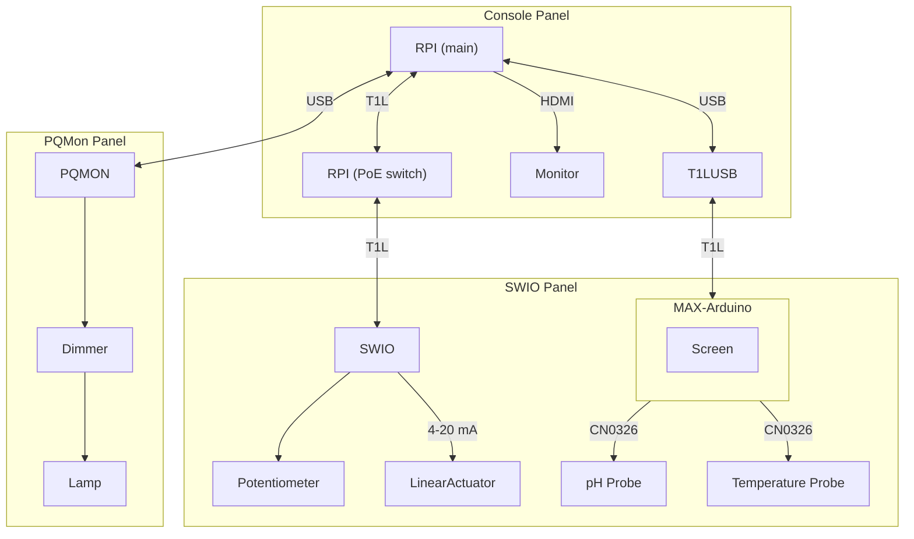

# Industrial Networks demo



# Setup assumptions

# Instructions

## Networking config

Run `bringup.sh` (will require you to type in the password 4 times)

## PQM - Scopy

Start Scopy (on desktop, 2.0.0 commit e4a093d). Connect to `/dev/ttyACM0,9600,8n1`. Open waveform plot, set timescale to 70ms, current range to +-1A.

## Network monitor

Run all as root (`sudo su` beforehand) because packet sniffing requires elevated privileges.

```
cd network-gui
python3 -m venv .venv
source .venv/bin/activate
pip install -r requirements.txt
python3 networkgui.py -i eth0,eth1
```

## SWIO

```
cd swio-resistance-current
python3 -m venv .venv
source .venv/bin/activate
pip install -r requirements.txt
python3 swiot_linear_pot_actuator.py
```

## MAX

```
./poke_maxim.sh
```

