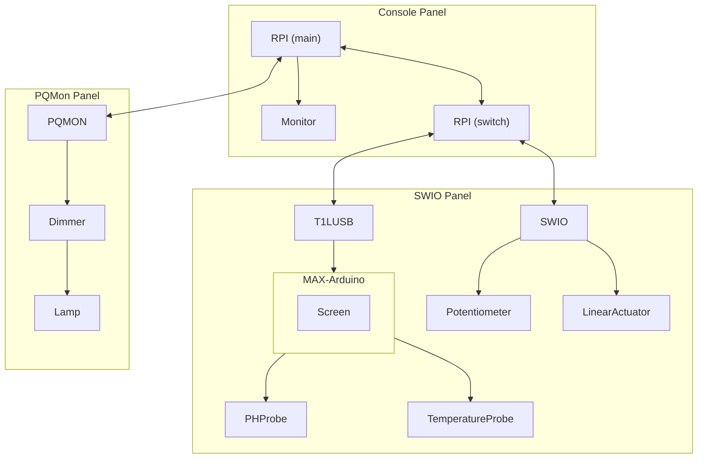

# Industrial Networks demo

```mermaid
graph TB
    subgraph ConsolePanel[Console Panel]
        Monitor
        Switch_rpi["RPI (switch)"]
        Main_rpi["RPI (main)"] --> Monitor
        Main_rpi <--> Switch_rpi
    end

    subgraph SWIOPanel[SWIO Panel]
        Potentiometer
        LinearActuator
        PHProbe
        TemperatureProbe
        SWIO
        SWIO --> Potentiometer
        SWIO --> LinearActuator
        subgraph MAX-Arduino
            Screen
        end
        MAT1L[T1LUSB] --> MAX-Arduino
        MAX-Arduino --> PHProbe
        MAX-Arduino --> TemperatureProbe
    end

    subgraph PQMonPanel[PQMon Panel]
        PQMON --> Dimmer --> Lamp
    end


    Switch_rpi <--> SWIO
    Switch_rpi <--> MAT1L
    Main_rpi <--> PQMON
```

