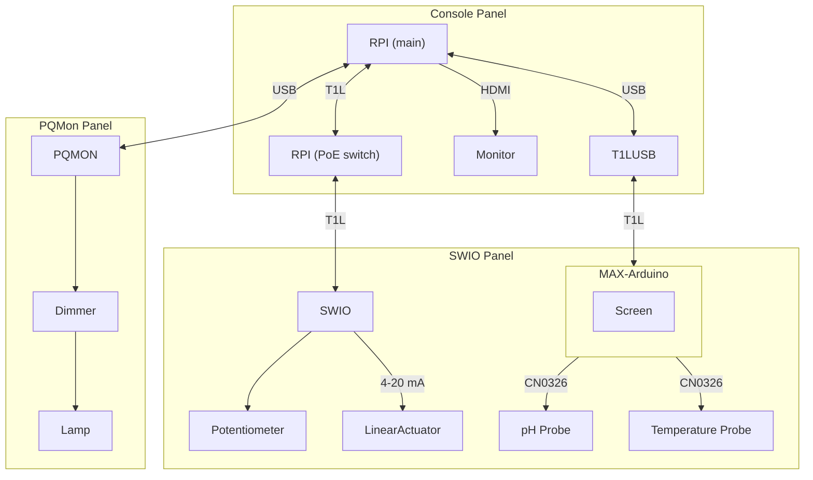

# Industrial Networks demo

```mermaid
flowchart
    subgraph ConsolePanel[Console Panel]
        Switch_rpi["RPI (PoE switch)"]
        Main_rpi <--T1L--> Switch_rpi
        Main_rpi["RPI (main)"] --HDMI--> Monitor
        Main_rpi <--USB--> T1LUSB
    end

    subgraph SWIOPanel[SWIO Panel]
        Potentiometer
        LinearActuator
        PHProbe
        TemperatureProbe
        SWIO
        SWIO --> Potentiometer
        SWIO --4-20 mA--> LinearActuator
        subgraph MAX-Arduino
            Screen
        end
        MAX-Arduino --CN0326--> PHProbe[pH Probe]
        MAX-Arduino --CN0326--> TemperatureProbe[Temperature Probe]
    end

    subgraph PQMonPanel[PQMon Panel]
        PQMON --> Dimmer --> Lamp
    end


    Switch_rpi <--T1L--> SWIO
    T1LUSB <--T1L--> MAX-Arduino
    Main_rpi <--USB--> PQMON
```

